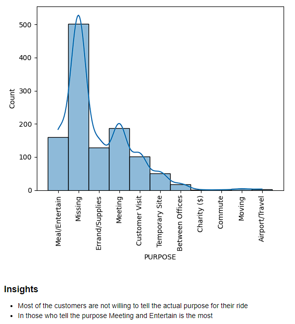
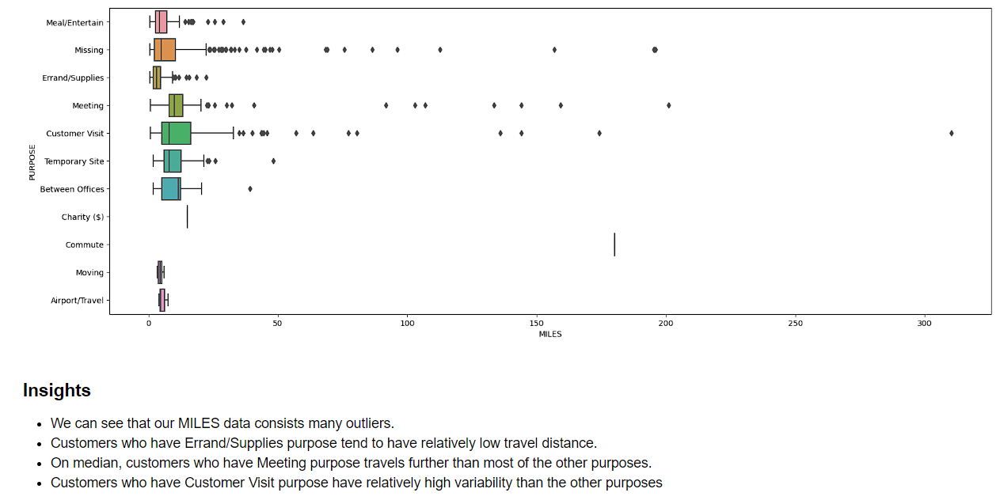

<div align="center">
  
</div>

# Uber Data Analysis

Welcome to the Uber Data Analysis project! In this project, I perform an in-depth exploration and analysis of Uber's ride-sharing data to uncover insights, trends, and patterns.


## Table of Contents

- [Introduction](#introduction)
- [Dataset](#dataset)
- [Notebook Content](#features)
- [Getting Started](#getting-started)
  - [Prerequisites](#prerequisites)
  - [Installation](#installation)
- [Usage](#usage)
- [Analysis Highlights](#analysis-highlights)
- [Contributing](#contributing)
- [Contact](#contact)

## Introduction

This Uber Data Analysis project offers a deep dive into the world of urban transportation, using Uber's extensive ride-sharing data as my compass. My exploration goes beyond the surface, unraveling the intricate threads that weave through modern cities, connecting commuters, destinations, and moments in time. By harnessing the power of data analysis, I unearth the hidden stories of urban mobility, revealing insights that empower decision-makers, urban planners, and curious minds alike. From deciphering peak travel hours and traffic hotspots to deciphering rider preferences and uncovering shifts in demand, my analysis aims to enrich the conversation around modern transportation dynamics.Join as I dissect the data, translate it into meaningful visualizations, and embark on a journey to make sense of the urban tapestry painted by Uber's ride-sharing activities. Whether you're a data enthusiast, a transportation professional, or simply curious about the rhythms of city life, my project invites you to explore, discover, and engage with the essence of urban mobility.

## Dataset

I will be working with the Uber dataset from 2016 which has multiple features like pickup drop-offf time , place total distance travelled purpose for the ride etc.

## Notebook Content

- Data loading and preprocessing
- Exploratory Data Analysis (EDA)
- Feature engineering

## Getting Started

To get started with this data analysis project, follow these steps:

### Prerequisites

Before users can start using this Uber data analysis project, you need to have a set of prerequisites installed and set up on your system. Here's a detailed list of prerequisites:

### Installation


1. Programming Environment:
- Python 
- Integrated Development Environment (IDE) like Jupyter Notebook, Visual Studio Code, or PyCharm (optional but recommended)
2. Libraries and Dependencies
Install the following libraries using the package manager 'pip' :
- Numpy
- Pandas
- Matplotlib
- Seaborn
here is an example to install Numpy:
```{python}
pip install Numpy
```
or if this doesnt work try instead :
```{python}
py -m pip install Numpy
```
Or you can just run the following python command to install the libraries:
```{python}
pip installl -r requirments.txt
```


## Usage

To use this notebook these are the following steps: 
1. Clone this repository to your local machine/ Download the repository.
2. Install the required dependencies as mentioned in the Dependencies section.
3. Open the Jupyter Notebook (Uber Data Analysis.ipynb) in Jupyter Notebook.
4. Execute the cells in sequential order to reproduce the analysis.

## Analysis Highlights

Here are some of the insights and highlights I have discovered in this data analysis:

- 
- 

## Contributing

Feel free to contribute to the Uber Data Analysis project, follow these steps:

1. Fork this repository.
2. Create a new branch: `git checkout -b feature-new-feature`
3. Make your changes and commit them: `git commit -am 'Add new feature'`
4. Push to the branch: `git push origin feature-new-feature`
5. Submit a pull request.

## Contact

If you have any questions or suggestions, please feel free to reach out to us:

- Email: priompalnfs@yahoo.com
- [Linkedin](https://www.linkedin.com/in/priom-pal-b32961194/) Priom Pal

Happy coding!
